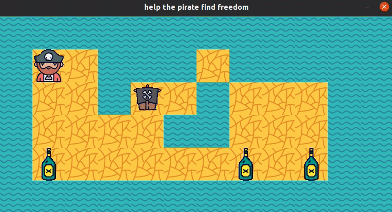

## so_long

project of 42 school where it is necessary to create a 2D game in C with the help of the minilibX graphic library. https://github.com/42Paris/minilibx-linux

the player has to collect the "collectibles" before he can leave the map through the exit. also you can create your own map adhering to the rules of building a map.

the goal is to join the exit with the minimum number of moves which are counted in the terminal.

the project was made in accordance with the school design code standard in the C language.



### how to use
the project will work only on linux.
```
make
./so_long maps/map.ber
```
use `W` `A` `S` `D` to move. `esc` to close the game.
